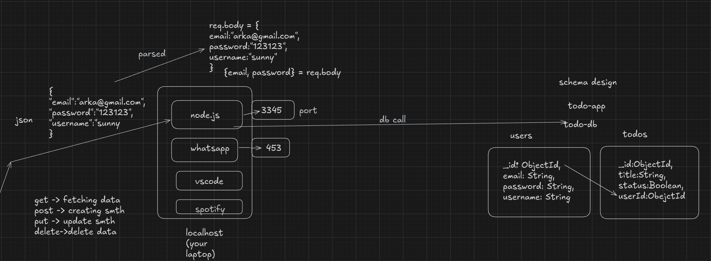
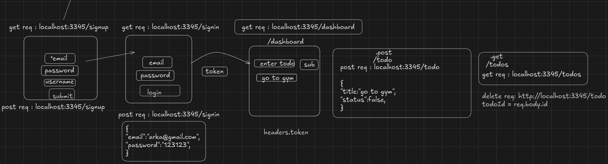

# Todo App

A full-stack task management API built with Express, MongoDB, and JWT authentication. Users can create, manage, and track their daily tasks with secure authentication.

## Tech Stack

- **Runtime:** Node.js
- **Framework:** Express.js
- **Database:** MongoDB with Mongoose
- **Authentication:** JWT + bcrypt

## Project Structure

```
todo-app/
├── assets/
│   ├── api-workflow.png        # API workflow visualization
│   └── system-design.png       # System design diagram
├── middleware/
│   └── authMiddleware.js       # Authentication middleware
├── routes/
│   └── user.js                 # User routes
├── db.js                       # Database models
├── index.js                    # Entry point
└── package.json
```

## Database Schema





## API Endpoints

### User Routes (`/api/v1/user`)

| Method | Endpoint | Description | Auth Required |
|--------|----------|-------------|---------------|
| POST | `/signup` | Register a new user | No |
| POST | `/signin` | Login user | No |
| GET | `/todos` | Get all todo | Yes |
| POST | `/todo` | Create a new todo | Yes |
| PUT | `/todo/:id` | Update an existing todo | Yes |
| DELETE | `/todo/:id` | Delete a todo | Yes |

## Getting Started

### Prerequisites

- Node.js (v14+)
- MongoDB (local or Atlas)

### Installation

```bash
# Clone the repository
git clone <repo-url>
cd todo-app

# Install dependencies
npm install

# Setup environment variables
cp .env.example .env
```

### Environment Variables

```env
PORT=3345
MONGO_URI=your_mongodb_uri
JWT_USER_PASSWORD=your_jwt_secret_key
```

### Running the Project

```bash
# Development mode
npm run dev

# Production
npm start
```

The server will start on `http://localhost:3345`

## Request/Response Examples

### User Signup
```bash
POST /api/v1/user/signup
{
  "email": "arka@gmail.com",
  "password": "123123",
  "username": "sunny"
}
```

### User Signin
```bash
POST /api/v1/user/signin
{
  "email": "arka@gmail.com",
  "password": "123123"
}
# Response: { "token": "eyJhbGciOiJIUzI1NiIs..." }
```

### Create Todo
```bash
POST /api/v1/user/todos
Authorization: Bearer <token>
{
  "title": "Go to gym",
  "description": "Morning workout session",
  "completed": false
}
```

### Get All Todos
```bash
GET /api/v1/user/todos
Authorization: Bearer <token>
```

### Update Todo
```bash
PUT /api/v1/user/todos/:id
Authorization: Bearer <token>
{
  "title": "Updated Title",
  "completed": true
}
```

### Delete Todo
```bash
DELETE /api/v1/user/todos/:id
Authorization: Bearer <token>
```

## License

ISC
